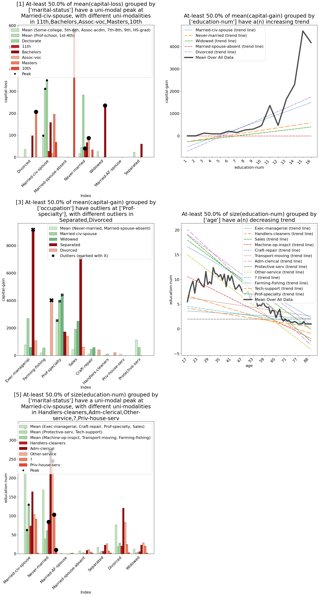

.. _explain-function - MetaInsight explainer:

MetaInsight Explainer
===========================================
The **MetaInsight explainer** automatically finds the most interesting common patterns in your data.
It provides insights into the relationships between columns, highlighting correlations, trends, and anomalies.

Method Signature
--------------------------

.. code-block:: python

    ExpDataFrame.explain(
                top_k: int = 4,
                min_commonness: float = 0.5,
                no_exception_penalty_weight=0.1,
                balance_factor: float = 1,
                filter_columns: List[str] | str = None,
                aggregations: List[Tuple[str, str]] = None,
                groupby_columns: List[List[str]] | List[str] = None,
                correlation_aggregation_method: Literal['avg', 'max', 'sum'] = 'avg',
                max_filter_columns: int = 3,
                max_aggregation_columns: int = 3,
                allow_multiple_aggregations: bool = False,
                allow_multiple_groupbys: bool = False,
                use_all_groupby_combinations: bool = False,
                display_mode: Literal['grid', 'carousel'] = 'grid',
                use_sampling: bool | None = None,
                sample_size: int | float = 5000,
    )

Parameters
--------------------------
- ``top_k``: Maximum number of patterns to return. Defaults to 4.
- ``min_commonness``: Minimum commonness of a pattern for it to be considered common. Defaults is 0.5, meaning that at-least 50% of a column's values must be present in the pattern.
- ``no_exception_penalty_weight``: Weight for the penalty applied to patterns that do not have exceptions. Defaults to 0.1. Exceptions are values that do not fit the pattern.
- ``balance_factor``: Relative weight between the number of common patterns and the number of exceptions when computing the score of a pattern. Defaults to 1 (balanced). Higher values will give more priority to common patterns without exceptions, while lower values will give more priority to patterns with exceptions.
- ``filter_columns``: Columns to filter the data by, defining the conditional distributions of the data. If None, will be automatically selected if a prior operation was performed on the DataFrame.
- ``aggregations``: Aggregations to apply to the data. If None, will be automatically selected if a prior operation was performed on the DataFrame.
- ``groupby_columns``: Columns to group the data by. If None, will be automatically selected if a prior operation was performed on the DataFrame.
- ``correlation_aggregation_method``: Automatic selection is done using correlation metrics. If there are multiple columns to compute correlation for, this parameter defines how to aggregate the correlation values. Can be 'avg', 'max', or 'sum'. Defaults to 'avg'.
- ``max_filter_columns``: Maximum number of filter columns to consider when selecting automatically. Defaults to 3.
- ``max_aggregation_columns``: Maximum number of aggregation columns to consider when selecting automatically. Defaults to 3.
- ``allow_multiple_aggregations``: If True, allows multiple multiple aggregations to be applied in the same pattern. Defaults to False. May result in complex and potentially less interpretable patterns if set to True.
- ``allow_multiple_groupbys``: If True, allows multiple groupbys to be applied in the same pattern. Defaults to False. May result in complex and potentially less interpretable patterns if set to True.
- ``use_all_groupby_combinations``: If True and used after a groupby operation with multiple columns, will use all combinations of the groupby columns to generate patterns. Defaults to False. If False, will only use the groupby columns as they are.
- ``display_mode``: How to display the patterns. Can be 'grid' or 'carousel'. Defaults to 'grid'. 'grid' will display the patterns in a a single plot, while 'carousel' will display them in a carousel format, allowing for easier navigation through the patterns.
- ``use_sampling``: Whether or not to use sampling when generating an explanation. This can greatly speed up the explanation generation process, but may result in less accurate explanations. Defaults to None, in which case the value set in the global configuration is used (which defaults to True).
- ``sample_size``: The number of samples to use when use_sampling is True. Can be either an integer or a float. If it is an integer, that number of samples will be used. If it is a float between 0 and 1, it will be interpreted as a percentage of the total number of samples. Defaults to 5000, which is also the minimum value.

Example Usage 1 - After GroupBy
----------------------------------
Using the MetaInsight explainer after a groupby operation will find patterns directly induced by the groupby operation.

.. code-block:: python

    import pandas as pd
    import pd_explain

    adults = pd.read_csv('adult.csv')

    by_marital_status = adults.groupby('marital-status').mean()
    by_marital_status.explain(explainer='metainsight', top_k=1)

**Output**:

Example Usage 2 - After Filtering / Join
--------------------------------------------
Using the MetaInsight explainer after a filtering operation will find patterns in the filtered data.

.. code-block:: python

    import pandas as pd
    import pd_explain

    adults = pd.read_csv('adult.csv')

    from_cuba = adults[adults['native-country'] == 'Cuba']
    filtered_adults.explain(explainer='metainsight', top_k=2)

**Output**:

Example Usage 3 - Manual Selection
--------------------------------------------
You can also manually select the filter columns, aggregations, and groupby columns to use in the MetaInsight explainer.
This allows you to have full control over what you wish to analyze, as well as allowing you to use the MetaInsight explainer directly on the original DataFrame without any prior operations.

.. code-block:: python

    import pandas as pd
    import pd_explain

    adults = pd.read_csv('adult.csv')

    adults.explain(
        explainer="metainsight",
        top_k=5,
        # It is enough to only set eithr filter_columns or groupby_columns + aggregations, and automatically the explainer will infer the other via correlation. In this case we set both for full manual control.
        filter_columns=['marital-status', 'workclass', 'education-num'],
        groupby_columns = [['race', 'marital-status'],
                            ['native-country', 'label'],
                            ['race', 'label']],
        aggregations=[
            ('capital-gain', 'mean'), ('capital-loss', 'mean'),('hours-per-week', 'mean')
        ],
        use_sampling=False,
        top_k=2,
    )

**Output**:

