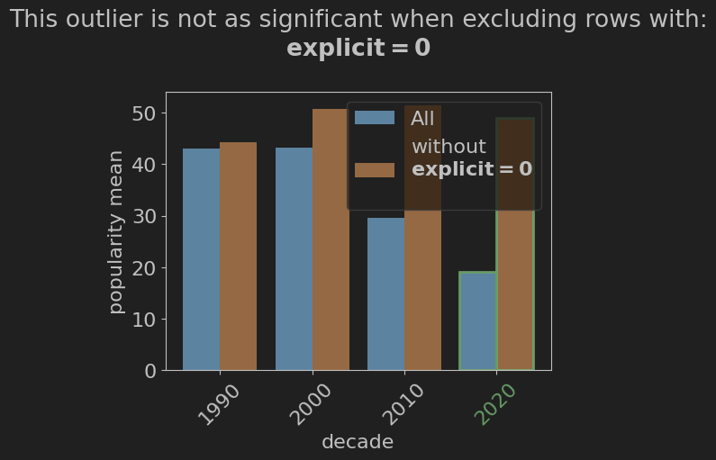

.. _explain-function - Outlier Explainer:

Outlier Explainer
=====================
The **Outlier Explainer** creates explanations for outliers in your data. Outliers are data points that are significantly different from the rest of the data, and can have a large impact on your analysis.
The Outlier Explainer can help explain why a data point is an outlier, and what features are contributing to it being an outlier.
Note that the outlier explainer is only supported for series that are the result of a groupby operation, not for dataframes.

Method Signature
-------------------
.. code-block:: python

    ExpSeries.explain(
        use_sampling : bool | None = None,
        sample_size : int | float = 5000,
        explainer: Literal['fedex', 'outlier', 'many_to_one', 'shapley', 'metainsight']='fedex',
        target=None,
        dir: Literal["high", "low", 1, -1] = None,
        control=None,
        hold_out=[]
    )

Parameters
----------------
- ``use_sampling`` (bool | None, optional): Whether or not to use sampling when generating an explanation. This can greatly speed up the explanation generation process, but may result in less accurate explanations. Defaults to None, in which case the value set in the global configuration is used (which defaults to True).
- ``sample_size`` (int | float, optional): The number of samples to use when use_sampling is True. Can be either an integer or a float. If it is an integer, that number of samples will be used. If it is a float between 0 and 1, it will be interpreted as a percentage of the total number of samples. Defaults to 5000, which is also the minimum value.
- ``explainer`` (Literal['fedex', 'outlier', 'many_to_one', 'shapley], optional): The explainer to use. Only 'outlier' is supported for the Outlier Explainer. Defaults to 'fedex'.
- ``target`` (Any, required): The target value for the outlier explainer. This is the value that is considered an outlier.
- ``dir`` (Literal["high", "low", 1, -1], required): The direction of the outlier. Can be either 'high' or 'low', or their corresponding 1 or -1. This determines whether the target value is considered an outlier because it is higher or lower than the rest of the data.
- ``control`` (List, optional): A list of control values for the grouping attribute.
- ``hold_out`` (List, optional): A list of attributes to be held out from the analysis.

Example Usage
------------------
.. code-block:: python

    # Import required packages
    import pandas as pd
    import pd-explain

    # Load some data
    spotify = pd.read_csv(r"c:\data\spotify.csv")

    # Perform operations and finally a group-by
    new_songs = spotify[spotify['year'] >= 1990]
    gb_decade = new_songs.groupby('decade')['popularity'].mean()

    # Explain an outlier in the result
    gb_decade.explain(explainer='outlier', target = 2020, dir='low')

**Output**:

**Output Description**
The output illustrates the effect of the `explicit` attribute on the outlier value of 2020.
From it, we can see that the value of the `explicit` attribute has a large effect on the popularity of a song in the 2020s, and that depending on its value, the mean popularity can be very similar to other decades, or much lower.

