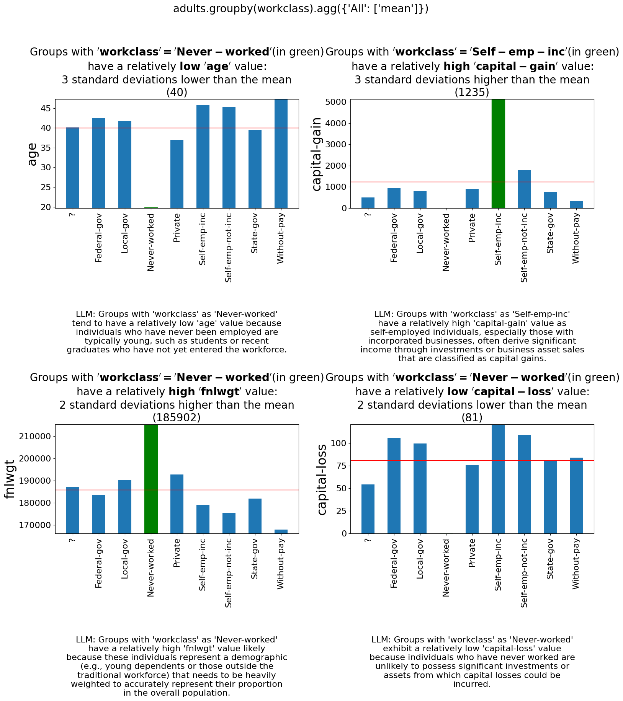
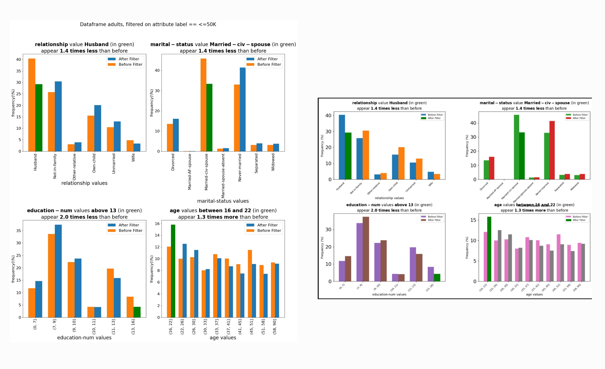

.. _llm-integrations:

PD-Explain LLM Integrations
=============================
PD-Explain provides several integrations with large language models (LLMs) to provide the following functionalities:

- **Explanation Reasoning**: Use LLMs to reason about the cause behind the explanations generated by PD-Explain, utilizing the LLM's knowledge of the world to provide additional context and insights.
- **Automated Data Exploration**: Automatically generate queries, analyze their results, and provide a summary of the findings, according to the user's instructions.
- **Visualization Beautification** (Beta): Use LLMs to automatically improve the aesthetics of visualizations, making them more visually appealing and easier to understand, by generating new visualization code based on the original visualization code.

Setup
----------------------
Each LLM functionality has its own settings which can be controlled separately.
Please refer to the `setup guide in our github repository <https://github.com/analysis-bots/pd-explain/blob/main/Examples/Notebooks/LLM%20Setup%20Guide.ipynb>`_.

Reasoning
--------------------------
The reasoning functionality allows you to use an LLM to reason about the cause behind the explanations generated by PD-Explain.
Reasoning is based on the LLM's knowledge of the world and a limited access to the data in the DataFrame.

Reasoning is currently supported for the following explainers:

- FEDEx explainer
- Outlier explainer
- Many to One explainer
- MetaInsight explainer

.. code-block:: python

    import pd_explain
    import pandas as pd

    # Load some data
    df = pd.read_csv("adult.csv")

    # Perform some operations on the data
    by_workclass = adults.groupby('workclass').mean()
    # Setting the add_llm_explanation_reasoning parameter to True will add an LLM reasoning explanation to the output.
    by_workclass.explain(top_k=4, add_llm_explanation_reasoning=True)

**Output**:

Automated Data Exploration
-----------------------------
The automated data exploration provides a way for you to simply instruct the LLM what you want to explore in the data,
and it will automatically generate queries, analyze their results using the fedex and MetaInsight explainers, and finally provide:

- A summary of the findings
- Visualization of the queries deemed most relevant by the LLM
- An interactive graph showing the query tree generated by the LLM

Method Signature
***********************

.. code-block:: python

    ExpDataFrame.automated_data_exploration(self,
        user_query: str,
        num_iterations: int = 10,
        queries_per_iteration: int = 5,
        fedex_top_k: int = 3,
        metainsight_top_k: int = 2,
        metainsight_max_filter_cols: int = 3,
        metainsight_max_agg_cols: int = 3,
        visualization_type: Literal['graph', 'simple'] = 'graph',
        verbose: bool = False,
        input_df: 'ExpDataFrame' = None,
        max_iterations_to_add: int = 3,
        beautify_fedex_visualizations: bool = False,
        beautify_metainsight_visualizations: bool = False,
        beautify_query_tree_visualizations: bool = False,
        beautify_all_visualizations: bool = False,
       ):

Parameters
************************
- ``user_query`` (str): The query to explore in the data. This is a natural language query that describes what you want to explore.
- ``num_iterations`` (int): The number of iterations to run the exploration for. Each iteration will generate new queries based on the previous iteration's results. Defaults to 10.
- ``queries_per_iteration`` (int): The number of queries to generate per iteration. Defaults to 5.
- ``fedex_top_k`` (int): The max number of explanations to generate for each query using the FedEx explainer. Defaults to 3.
- ``metainsight_top_k`` (int): The max number of explanations to generate for each query using the MetaInsight explainer. Defaults to 2.
- ``metainsight_max_filter_cols`` (int): The maximum number of filter columns to use in the MetaInsight explainer. Defaults to 3.
- ``metainsight_max_agg_cols`` (int): The maximum number of aggregation columns to use in the MetaInsight explainer. Defaults to 3.
- ``visualization_type`` (Literal['graph', 'simple']): The type of visualization to generate for the queries. Can be either 'graph' or 'simple'. 'graph' will generate an interactive graph showing the query tree, while 'simple' will generate a simple visualization of the queries. Defaults to 'graph'.
- ``verbose`` (bool): Whether to print progress messages during the exploration. Defaults to False.
- ``input_df`` (ExpDataFrame): The input DataFrame to use for the exploration. If None, the current DataFrame will be used. Defaults to None.
- ``max_iterations_to_add`` (int): The maximum number of iterations to add in case of failure during some of the iterations. This is useful to ensure that the exploration is successful even if some iterations fail. Defaults to 3. Failure is defined as the LLM not being able to generate any queries for the current iteration.
- ``beautify_fedex_visualization`` (bool): Whether the use the beautification functionality to try to improve the aesthetics of the FedEx visualizations generated by the exploration. Defaults to False.
- ``beautify_metainsight_visualizations`` (bool): Whether the use the beautification functionality to try to improve the aesthetics of the MetaInsight visualizations generated by the exploration. Defaults to False.
- ``beautify_query_tree_visualizations`` (bool): Whether the use the beautification functionality to try to improve the aesthetics of the query tree visualizations generated by the exploration. Defaults to False.
- ``beautify_all_visualizations`` (bool): Whether to use the beautification functionality to try to improve the aesthetics of all visualizations generated by the exploration. Defaults to False. Overrides the previous three parameters if set to True.

Example Usage
************************

.. code-block:: python

    import pd_explain
    import pandas as pd

    # Load some data
    df = pd.read_csv("adult.csv")

    adults.automated_data_exploration(
        "Explore the effect that education and occupation have on one's capital-loss and capital-gain"
    )

Please see our `demo notebook <https://github.com/analysis-bots/pd-explain/blob/main/Examples/Notebooks/LLM%20Automated%20Exploration%20Demo.ipynb>`_ for examples of the output of the automated data exploration functionality's output.
Saving and Loading Exploration Results
************************************************
You can save the results of the automated data exploration to a file, and load it later to continue exploring or to visualize the results.

.. code-block:: python

    # Save the exploration results to a file
    adults.save_data_exploration("exploration_results.dill")

    # Load the exploration results from a file. This method is static, so you can call it without an instance of ExpDataFrame.
    adults.visualize_from_saved_data_exploration("exploration_results.dill")

Followup For PD-Explain Explanations
********************************
Automated data exploration also provides a followup functionality that allows you to ask the LLM to provide followup analysis on the explanations generated by PD-Explain.
This followup analysis looks for context within the data for the explanations, to explain why exactly the insight given by the explanation occurs.
Additionally, if the explanation includes reasoning, the followup analysis will also try to corroborate or refute the reasoning provided by the LLM.

.. code-block:: python

    import pd_explain
    import pandas as pd

    # Load some data
    df = pd.read_csv("adult.csv")

    # Perform some operations on the data
    by_workclass = adults.groupby('workclass').mean()
    explanation = by_workclass.explain(top_k=4, add_llm_explanation_reasoning=True)

    # Ask the LLM to provide followup analysis on the explanation
    by_wokrclass.follow_up_with_automated_data_exploration(
        # The index of the explanation to follow up on. For fedex, 0 is the top-left explanation, 1 is to the right of it, so on.
        # For MetaInsight, 0 is the top-most explanation. For many to one, 0 is the first row of the dataframe.
        explanation_index=0
        # The rest of the parameters are the same as for the automated_data_exploration method.
    )

Beautification
---------------------------
The beautification functionality allows you to use an LLM to try and automatically improve the aesthetics of visualizations generated by PD-Explain.
The beautification process will generate new visualization code based on the original visualization code, and will try to make it more visually appealing and easier to understand.
This process is iterative, meaning that it will try to improve the visualization code multiple times until it reaches a satisfactory result or the maximum number of iterations is reached.

Beautification is currently supported for the following explainers:

- FEDEx explainer
- MetaInsight explainer

Method Signature
***********************
The usage of beautify is done by passing the `beautify` parameter to the `explain` method of the DataFrame or Series.

.. code-block:: python

    ExpDataFrame.explain(
        explainer: Literal['fedex', 'outlier', 'many_to_one', 'shapley', 'metainsight'] = 'fedex',
        beautify: bool = False,
        beautify_max_fix_attempts: int = 10,
        silent_beautify: bool = True,
        # The rest of the parameters are the same as for the explain method.
    )

Parameters
***********************
- ``beautify`` (bool): Whether to use the beautification functionality to try to improve the aesthetics of the visualizations generated by the explainer. Defaults to False.
- ``beautify_max_fix_attempts`` (int): The maximum number of attempts to fix the visualization. Defaults to 10.
- ``silent_beautify`` (bool): Whether to suppress the beautification progress messages. Defaults to True. If set to False, the beautification process will print progress messages to the console.

Example Usage
***********************
.. code-block:: python

    import pd_explain
    import pandas as pd

    # Load some data
    df = pd.read_csv("adult.csv")

    # Perform some operations on the data
    low_income = adults[adults['label'] == '<=50K']

    # Explain the data and beautify the visualizations
    low_income.explain(top_k=4, beautify=True)

**Output**:

On the left, is the original visualization generated by PD-Explain, and on the right is the beautified version of the same visualization.

You will be provided with both visualizations in an interactive widget.
